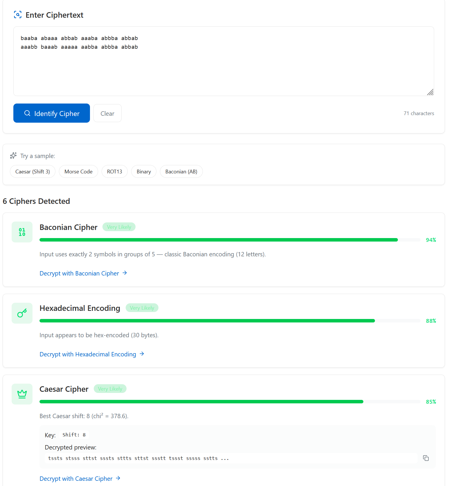
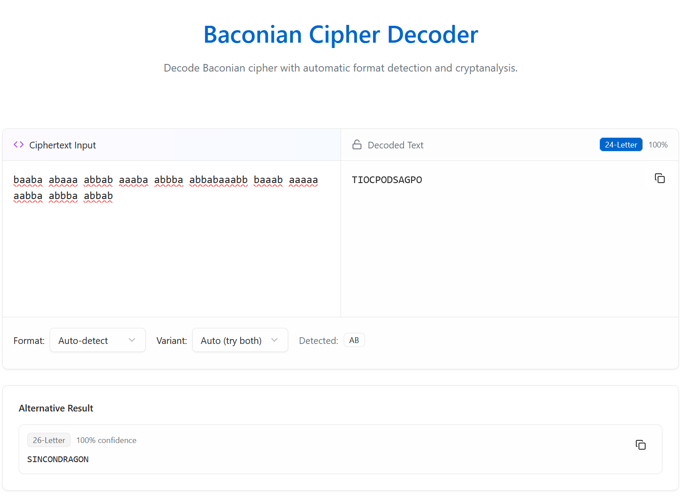

After connecting the board to the system and activating the CTF, the challenge begins!

The challenge statement is given as follows:
`baaba abaaa abbab aaaba abbba abbab` 
`aaabb baaab aaaaa aabba abbba abbab` 

This is clearly a cipher but I don't really recognize it. So let us try to identify it with cipher decryption tools - https://caesarcipher.org/ciphers/identifier

In this case, we try the highest probability - Baconian Cipher.

And we get the following result:
> SINCONDRAGON

Remember that the flags are lower cases, So input `sincondragon` into the serial monitor and you get the first LED lighted up!
