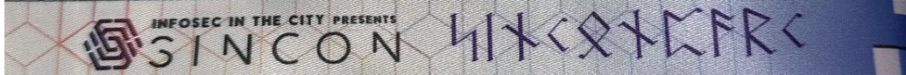
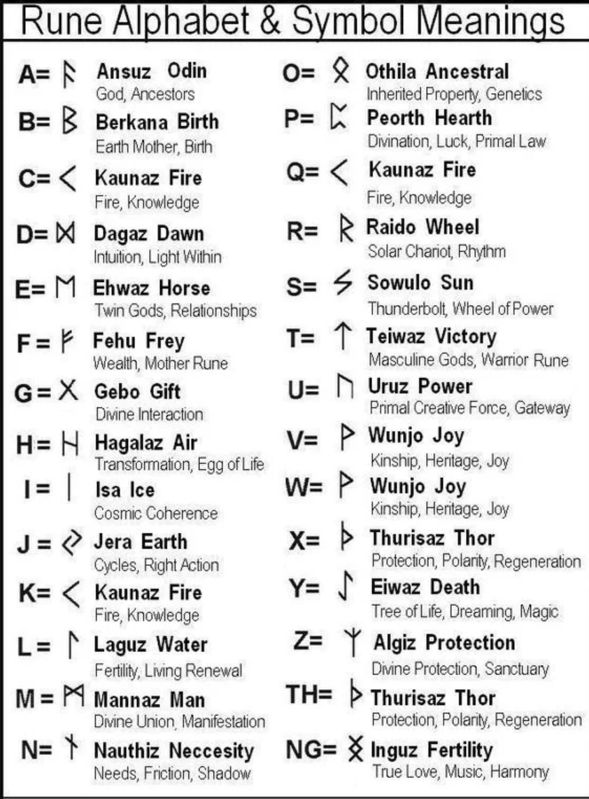

After completing challenge 1, we move onto challenge 2 by typing 1 into the serial monitor.

Here's the next challenge:

`That’s one beautiful lanyard, innit?`

Using Gemini, we manage to decode it to Elder Futhark runes, and with some AI help, get the answer decoded to `sinconparc`

