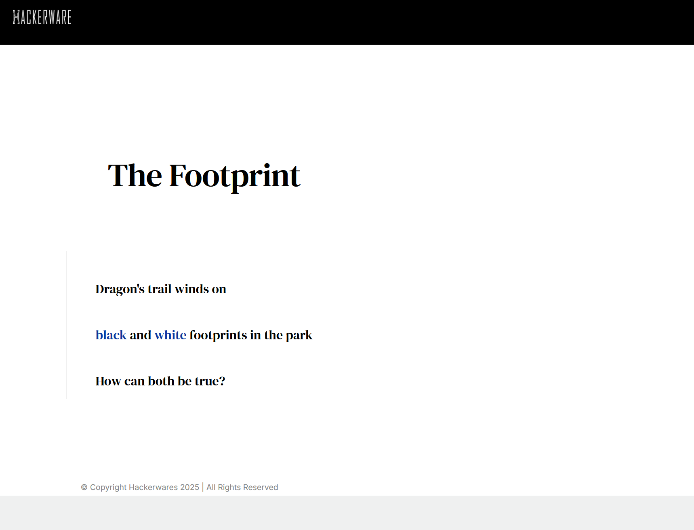
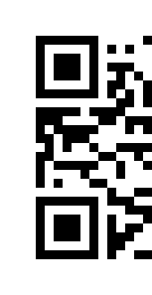
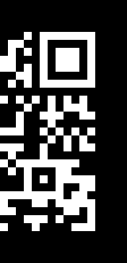
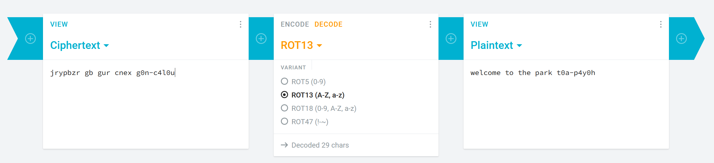

After completing challenge 2, we move onto challenge 3 by typing 2 into the serial monitor.

And the challenge presented is:

    aGFja2Vyd2FyZS5pby9zaW5jb24yMDI1LWNoYWxsZW5nZS1h

This is a base64 (if unsure, you can use the same tool in challenge 1 for help) and we get it decoded: [hackerware.io/sincon2025-challenge-a](https://hackerware.io/sincon2025-challenge-a) 

And the links give us 2 images
[Link 1](https://hackerware.io/sincon2025-qr-1.png) 
[Link 2](https://hackerware.io/sincon2025-qr-2.png) 

 

We had to make it into one QR image and make it the same base color for easier scanning.

Once we scanned it, we get `jrypbzr gb gur cnex g0n-c4l0u` 

Identifying the cipher, we get **ROT13** and once decoded:

We get `welcome to the park t0a-p4y0h` as the plain text. Hence entering the code **t0a-p4ybh** we complete the challenge.
