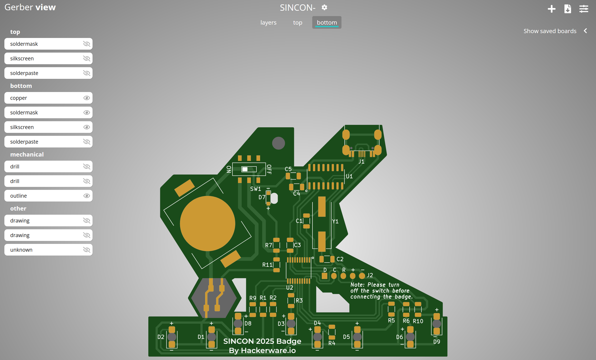
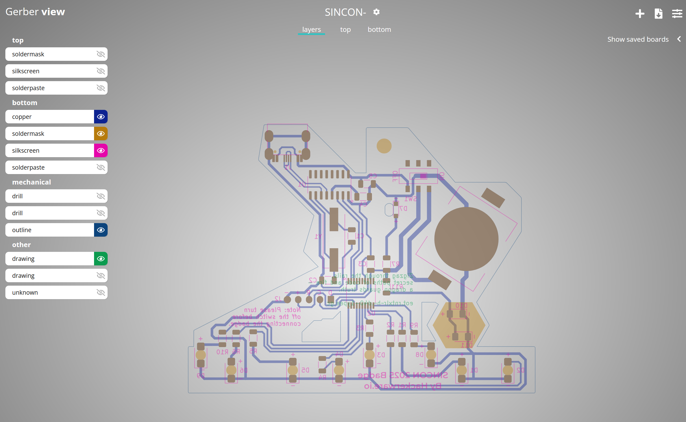
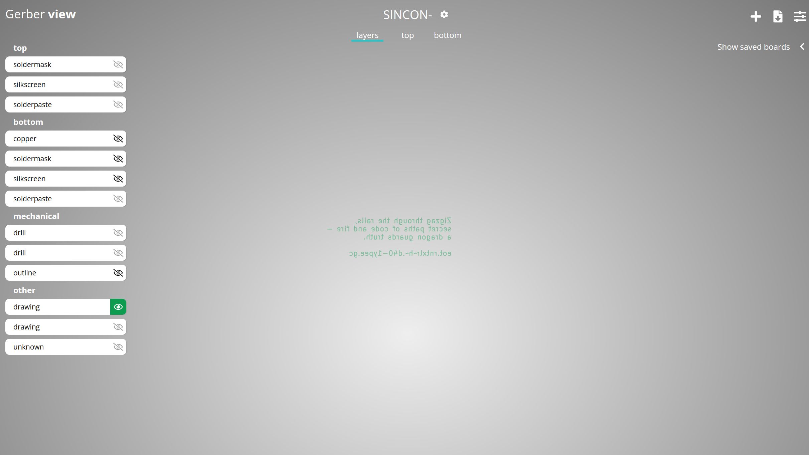
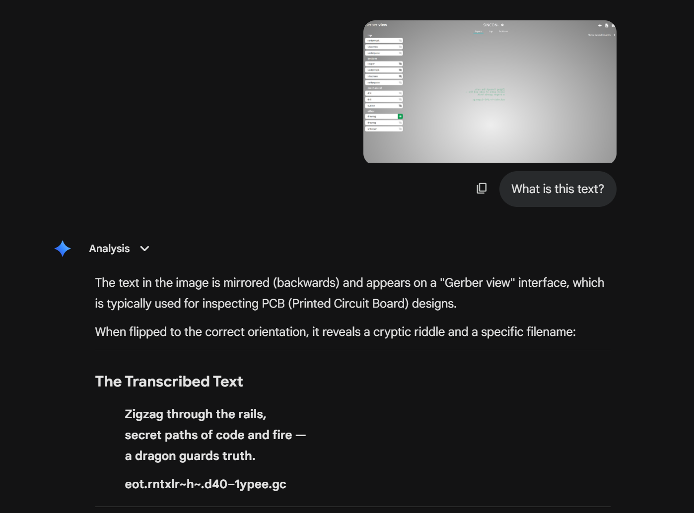
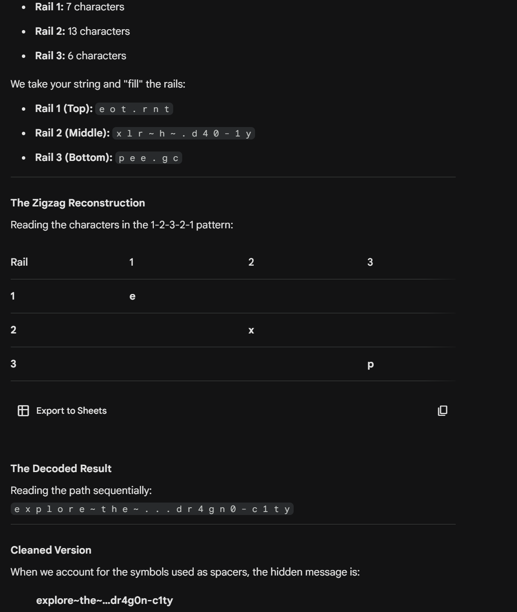

After completing challenge 1, we move onto challenge 2 by typing 3 into the serial monitor.

Again, we are starting with a base64 challange.

`aGFja2Vyd2FyZS5pby9zaW5jb24yMDI1LWdlcmJlci56aXA=`

This time we get [hackerware.io/sincon2025-gerber.zip](https://hackerware.io/sincon2025-gerber.zip). Inside the zip file, a bunch of files with the .gbr files. These are gerber files used in designing PCB's, or in this case, design of the badge itself.

Using an [online viewer](https://www.pcbway.com/project/OnlineGerberViewer.html), we get to see the design itself.

We can see some additional text being injected into the design. By removing the (other) layers, we see the code.

`Zigzag through the rails, secret paths of code and fire — a dragon guards truth.
eot.rntxlr~h~.d40–1ypee.gc`

Often in puzzles of this type, a 3-rail zigzag is used to further obscure the path.

Once cleaned up, the hidden message is: `explore~the~…dr4g0n-c1ty`

As such, the flag is **dr4g0n-c1ty** and we have completed the challenge.
