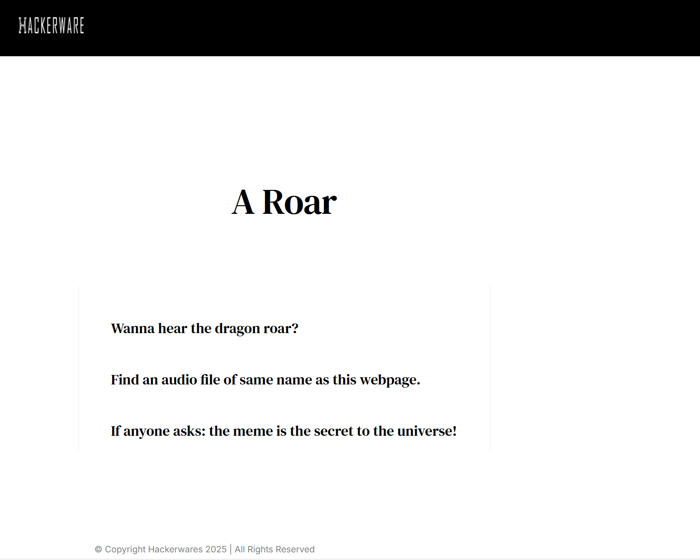
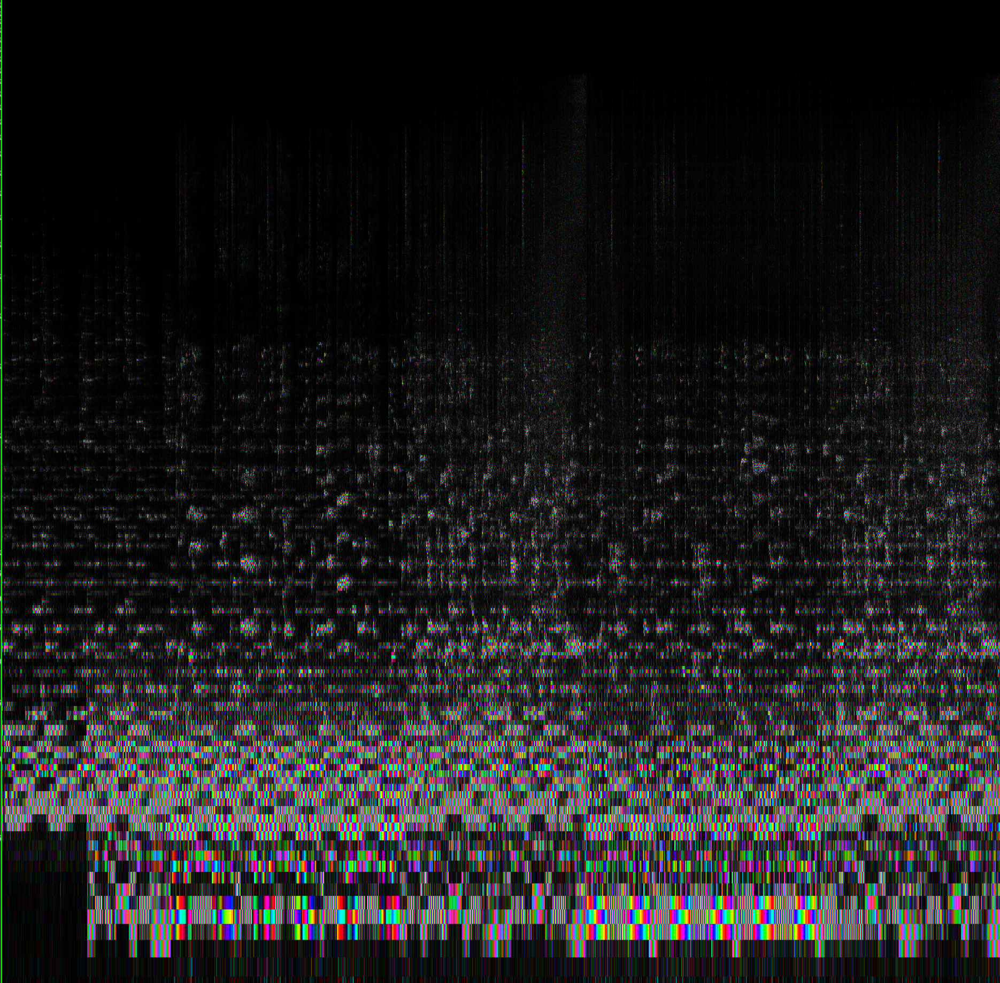
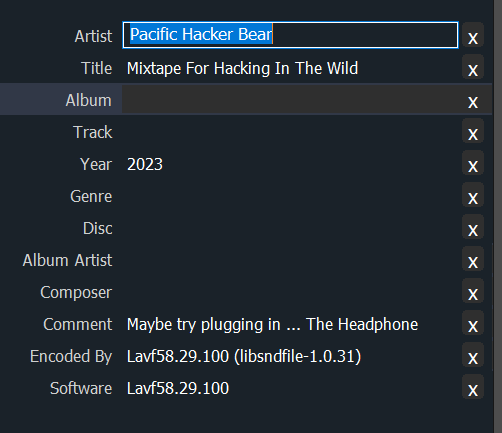

After completing challenge 4, we move onto challenge 5 by typing 4 into the serial monitor.

And yet again another base64 challenge:
`aGFja2Vyd2FyZS5pby9zaW5jb24yMDI1LWRyYWdvbi1yb2Fy`

This time we get [hackerware.io/sincon2025-dragon-roar](https://hackerware.io/sincon2025-dragon-roar).

> A Roar

> Wanna hear the dragon roar?

> Find an audio file of same name as this webpage.

> If anyone asks: the meme is the secret to the universe!

Since audio files are usually in .mp3/.aac/.wav format, these are the formats to try first. In this case, [.wav](https://hackerware.io/sincon2025-dragon-roar.wav) worked. 

On the spectogram side, nothing interesting. 

On the audio ID-Tag, also nothing interesting.

So this is a stegnography challenge. Moving on to StegHide, it seems like it is correct since it is now asking for a pharaphrase. Since the music is from Rick ASTLEY, throwing this riddle to Gemini prompted some hints. 

In this case, `rickroll` was the passphrase.

> A rickroll (or rickrolling) is an internet prank where a person provides a disguised hyperlink that, when clicked, leads to the music video for Rick Astley’s 1987 hit "Never Gonna Give You Up".

A file named  was returned.

`The dragon will... bre4th-f1r3`

Hence, the flag is **bre4th-f1r3** and we complete this challenge!
