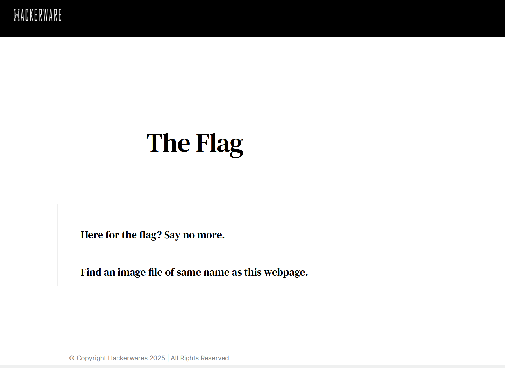
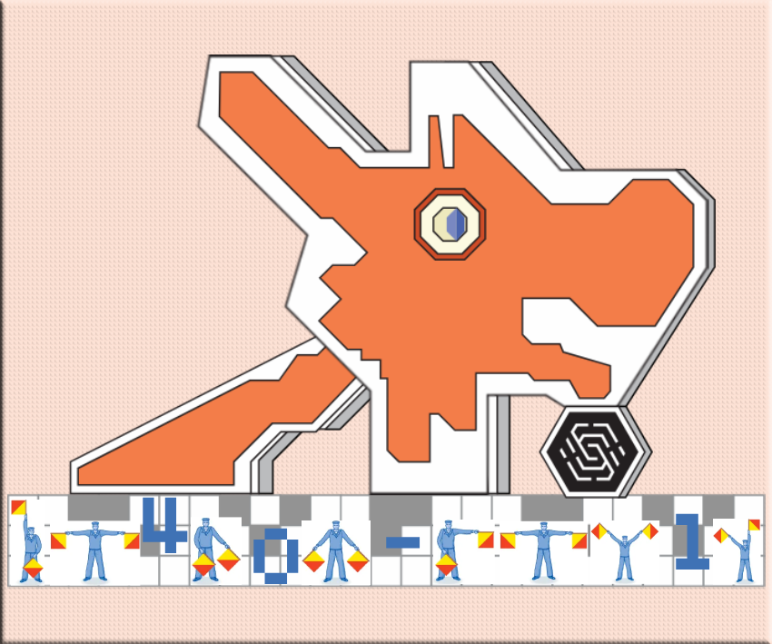
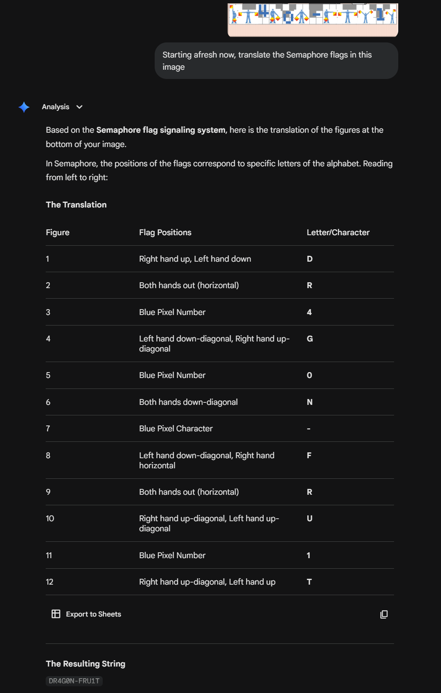
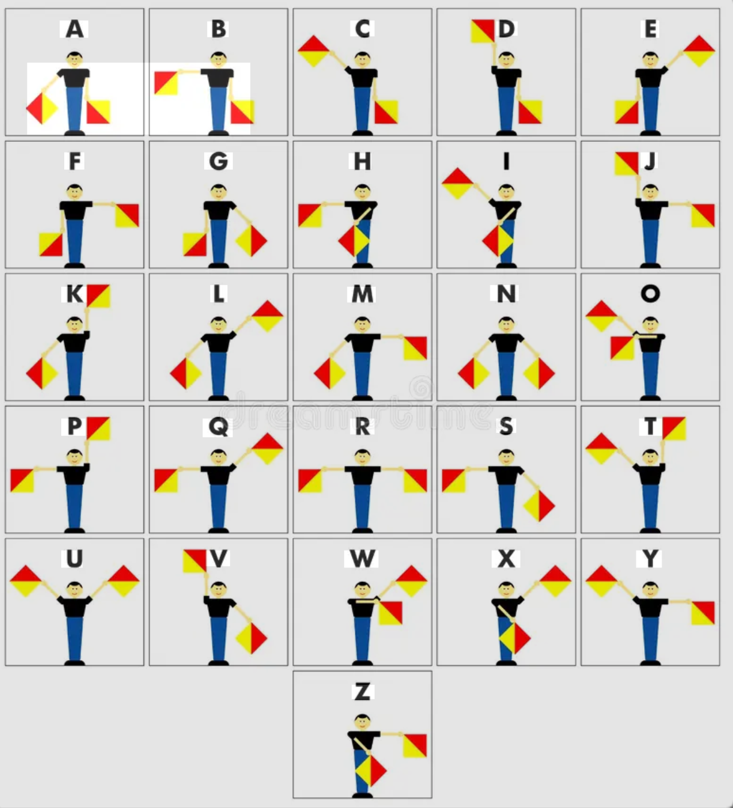

After completing challenge 5, we move onto challenge 6 by typing 5 into the serial monitor.

I guess we are so familiar with base64 now:

`aGFja2Vyd2FyZS5pby9zaW5jb24yMDI1LWNoYWxsZW5nZS1i`

This challenge, we get [hackerware.io/sincon2025-challenge-b](https://hackerware.io/sincon2025-challenge-b).

> Here for the flag? Say no more. 

> Find an image file of same name as this webpage.

Since audio files are usually in .png/.jpg/.heic format, these are the formats to try first. In this case, [.png](https://hackerware.io/sincon2025-challenge-b.png) worked. 

What is interesting on this page was the Semaphore flags located at the bottom of the dragon. Decoding that with the help of Gemini and the table, we get the following below.

As such, we get `DR4G0N-FRU1T` and using lower case, we get and enter **dr4g0n-fru1t** into the serial monitor and challenge is solved.

The Semaphore flags table reference:

