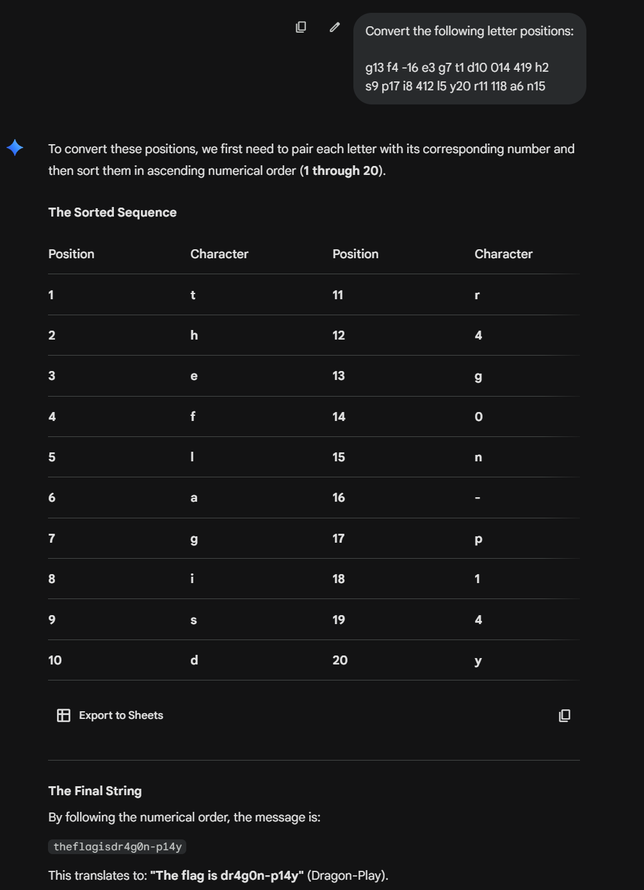

After completing challenge 6, we move onto challenge 7 by typing 6 into the serial monitor.

`g13 f4 -16 e3 g7 t1 d10 014 419 h2`

`s9 p17 i8 412 l5 y20 r11 118 a6 n15`

Something refreshing for this challenge, no longer base64! Decoding this, it is identified as Letter Positions.

Now decoding it gets us: `theflagisdr4g0n-p14y`

Entering **dr4g0n-p14y** into the serial monitor finishes this challenge!

