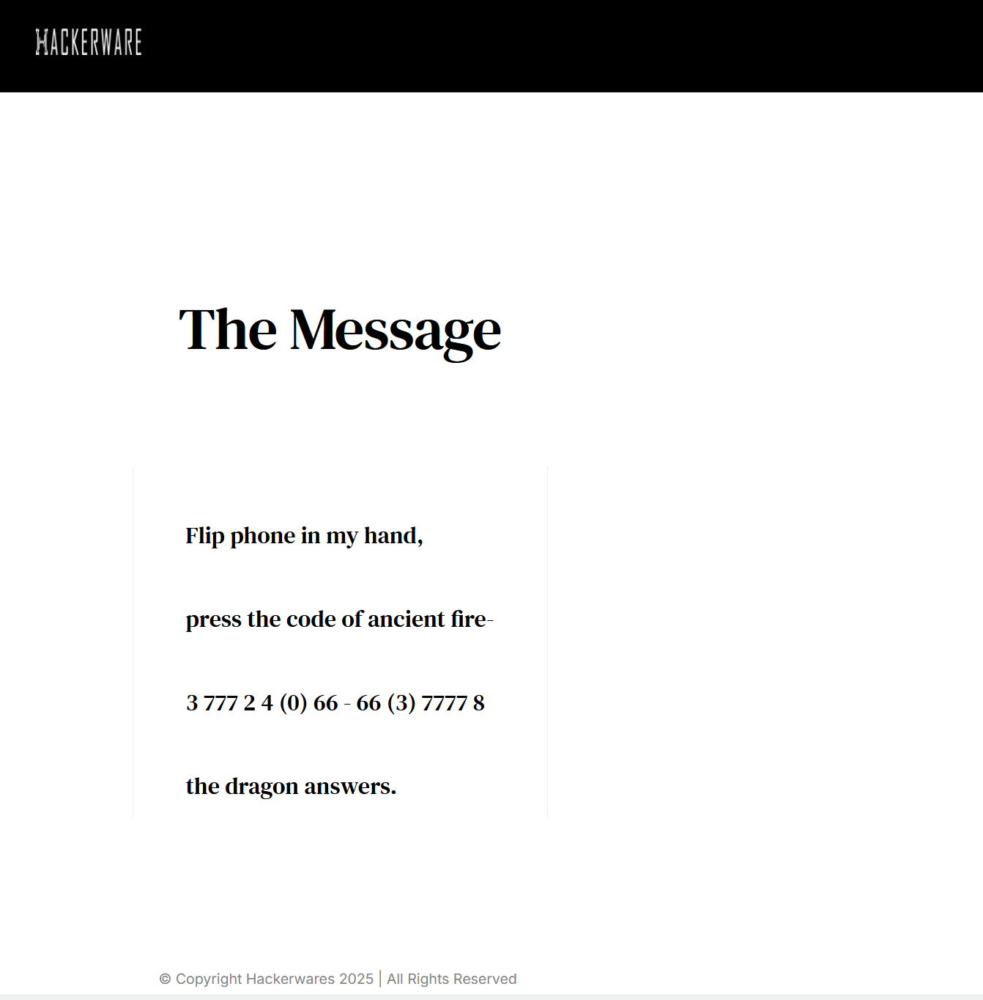
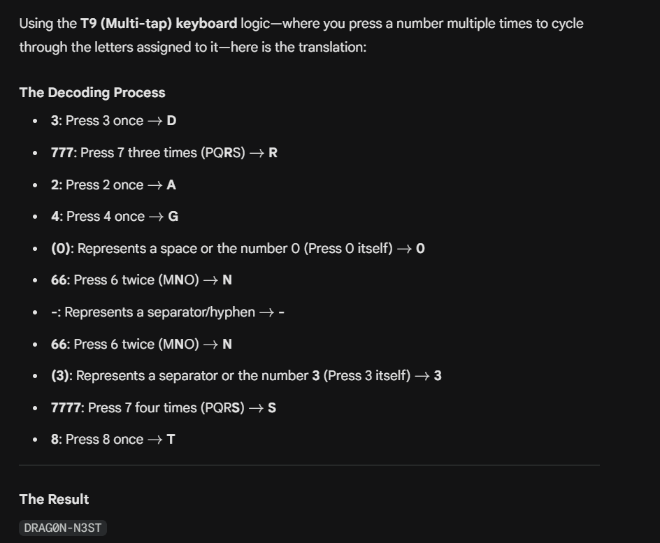

After completing challenge 7, we move onto challenge 8 by typing 7 into the serial monitor.

And now back to our favourite encoding - base64 again!

`aGFja2Vyd2FyZS5pby9zaW5jb24yMDI1LWNoYWxsZW5nZS1j`

Decoding this, we get [hackerware.io/sincon2025-challenge-c](https://hackerware.io/sincon2025-challenge-c).

> Flip phone in my hand,
> press the code of ancient fire-
> 3 777 2 4 (0) 66 - 66 (3) 7777 8
> the dragon answers.

This challenge is rather simple - its a T9 code!

Translating it directly, we get `DRAG0N-N3ST`. Entering **drag0n-n3st** into the serial monitor, we have completed this challenge and the Badge itself!

