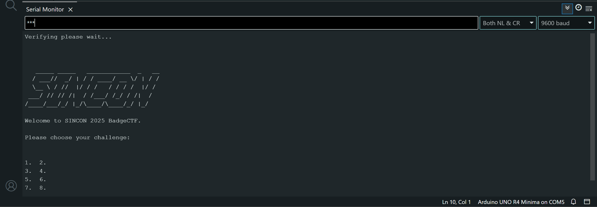

To get started for the board, you will need to download the Arduino IDE. Arduino IDE can be downloaded from the official site - https://www.arduino.cc/en/software

Once downloaded and running, connect the badge board to the computer using a USB-C cable and follow the following steps:
 - Go to tools
 - Select USB
 - And select the correct USB device. (If neccessary, select Arduino UNO device)

To activate the serial monitor:

 - Go to tools
 - Select Serial Monitor
 - A command-like interface will pop up
 - On the right bottom corner change to the right settings: **Both NL & CR with 9600 baud**
 
 To get started once the setup is done:
 - send `***` in the serial monitor interface. The challenge should officially start.

Do note that **All flags are in lowercase without any brackets**

